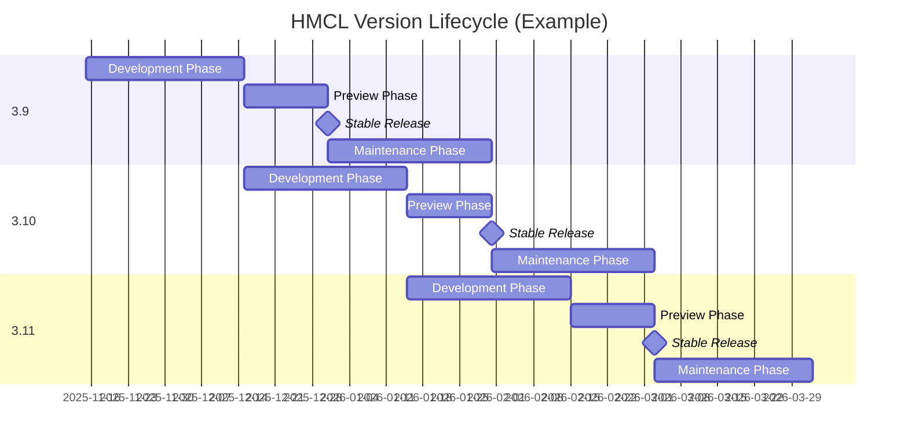

# Hello Minecraft! Launcher Release Schedule

<!-- #BEGIN LANGUAGE_SWITCHER -->
**English** | 中文 ([简体](ReleaseSchedule_zh.md), [繁體](ReleaseSchedule_zh_Hant.md))
<!-- #END LANGUAGE_SWITCHER -->

This document describes the HMCL version release schedule starting from October 2025.

## Versioning Rules

### Version Branches

HMCL has multiple **version branches**, each named in the format `<major>.<minor>` (e.g., `3.7`).

The major version is incremented only when there are significant architectural changes in HMCL,
while the minor version is incremented regularly according to the release schedule.

### Version Types

HMCL has two types of versions: **Stable** and **Development**.

#### Stable Version

The HMCL stable version is suitable for users who prioritize software stability.
New features are merged into the stable version only after thorough testing.

The stable version number follows the naming rule `<version branch>.<build number>` (e.g., `3.7.1`).
The build number is calculated independently for each version branch.

#### Development Version

The HMCL development version is suitable for users who want to experience new features first.
The development version includes the latest features and bug fixes,
but may also have more issues due to insufficient testing.

The development version follows the naming rule `<version branch>.0.<build number>` (e.g., `3.7.0.300`).
The build number is shared globally across all version branches.

## Release Channels

HMCL has two main release channels: **Stable Channel** and **Development Channel**.
They are used to release the HMCL stable and development versions, respectively.

To test HMCL versions before official release, we will push updates to some users in advance.
Users can enable the "Preview HMCL releases early" option on the "Settings > General" page to receive preview updates from the corresponding channel.

## Release Model

In general, we release a new version branch every month,
and each version branch `x.y` has a lifecycle of two and a half months.

The lifecycle of each version branch is divided into the following stages:

1. **Development Phase** (Mid-month M ~ Mid-month M+1)

   During this phase, the version is developed in the Git branch `main`.

   Typically, we release a development version `x.y.0.<build number>` based on this branch every week,
   which includes all features and bug fixes merged during the week.

2. **Preview Phase** (Mid-month M+1 ~ End of month M+1)

   In mid-month M+1, we fork the `main` branch to create the `release/x.y` branch,
   which corresponds to the fixed version branch `x.y`.

   At the same time, the version branch corresponding to the `main` branch is incremented to `x.y♯`,
   entering the development phase of the next version branch.

   After the fork, no new features will be added to this version branch;
   only bug fixes and data updates will be made.

   Within a few days, we will release a stable preview version `x.y.1` and
   push it to users in the stable channel who have enabled preview updates.

   Before the end of month M+1, the stable version corresponding to version branch `x.y` will remain in preview status.
   If issues are found during the preview, we will release and push new stable preview versions (such as `x.y.2`, `x.y.3`, etc.) after fixing them.

3. **Stable Release** (End of month M+1)

   At the end of month M+1, if there are no unexpected issues, we will promote the latest stable preview `x.y.z` to the official release and push it to all users in the stable channel.

4. **Maintenance Phase** (Month M+2)

   In month M+2, version branch `x.y` enters the maintenance phase.
   We will release stable updates irregularly based on the number and severity of issues fixed,
   and push them to all users in the stable channel.

   At the end of month M+2, after the official release of the stable version corresponding to version branch `x.y♯`, the lifecycle of version branch `x.y` ends, the Git branch `release/x.y` is
   archived, and no longer receives updates.

## Long-Term Support Version Branches

Some special version branches are selected as Long-Term Support (LTS) branches.
Their lifecycle does not end with the official release of the next version branch's stable version.
We will continue to backport necessary patches to these branches for a longer period.

List of Long-Term Support Version Branches:

| Version Branch | Official Release Date | End of Lifecycle | Current Support Status | Notes                                                                                                                                |
|----------------|:---------------------:|:----------------:|:----------------------:|:-------------------------------------------------------------------------------------------------------------------------------------|
| 3.6            |   November 23, 2024   |       TBD        |       Supported        | This is the last version branch that supports running on Java 8. It is suitable for users on legacy platforms such as Windows XP. |
