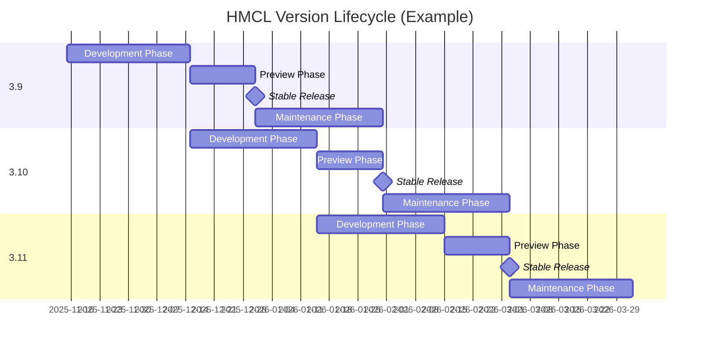

# جدول إصدارات مُشغّل Hello Minecraft!

<!-- #BEGIN LANGUAGE_SWITCHER -->
**الإنجليزية** | [中文](ReleaseSchedule_zh.md)
<!-- #END LANGUAGE_SWITCHER -->

يصف هذا المستند جدول إصدارات نسخ HMCL ابتداءً من أكتوبر 2025.

## قواعد الترقيم

### فروع الإصدارات

يحتوي HMCL على **فروع إصدارات** متعددة، كل منها يُسمى بالصيغة `<major>.<minor>` (مثل `3.7`).

يتم زيادة الإصدار الرئيسي فقط عند وجود تغييرات معمارية كبيرة في HMCL،
بينما يتم زيادة الإصدار الفرعي بانتظام وفقًا لجدول الإصدار.

### أنواع الإصدارات

يحتوي HMCL على نوعين من الإصدارات: **المستقر** و**التطويري**.

#### الإصدار المستقر

إصدار HMCL المستقر مناسب للمستخدمين الذين يعطون الأولوية لاستقرار البرنامج.
يتم دمج الميزات الجديدة في الإصدار المستقر فقط بعد اختبار شامل.

يتبع رقم الإصدار المستقر قاعدة التسمية `<version branch>.<build number>` (مثل `3.7.1`).
يتم حساب رقم البناء بشكل مستقل لكل فرع إصدار.

#### الإصدار التطويري

إصدار HMCL التطويري مناسب للمستخدمين الذين يريدون تجربة الميزات الجديدة أولاً.
يتضمن الإصدار التطويري أحدث الميزات وإصلاحات الأخطاء،
لكنه قد يحتوي أيضًا على مشاكل أكثر بسبب الاختبار غير الكافي.

يتبع الإصدار التطويري قاعدة التسمية `<version branch>.0.<build number>` (مثل `3.7.0.300`).
رقم البناء مشترك عالميًا عبر جميع فروع الإصدارات.

## قنوات الإصدار

يحتوي HMCL على قناتي إصدار رئيسيتين: **القناة المستقرة** و**القناة التطويرية**.
تُستخدمان لإصدار نسخ HMCL المستقرة والتطويرية، على التوالي.

لاختبار إصدارات HMCL قبل الإصدار الرسمي، سنقوم بدفع التحديثات لبعض المستخدمين مسبقًا.
يمكن للمستخدمين تفعيل خيار "معاينة إصدارات HMCL مبكرًا" في صفحة "الإعدادات > عام" لتلقي تحديثات المعاينة من القناة المقابلة.

## نموذج الإصدار

بشكل عام، نقوم بإصدار فرع إصدار جديد كل شهر،
وكل فرع إصدار `x.y` له دورة حياة مدتها شهرين ونصف.

تنقسم دورة حياة كل فرع إصدار إلى المراحل التالية:

1. **مرحلة التطوير** (منتصف الشهر M ~ منتصف الشهر M+1)

   خلال هذه المرحلة، يتم تطوير الإصدار في فرع Git المسمى `main`.

   عادةً، نقوم بإصدار نسخة تطويرية `x.y.0.<build number>` بناءً على هذا الفرع كل أسبوع،
   والتي تتضمن جميع الميزات وإصلاحات الأخطاء المدمجة خلال الأسبوع.

2. **مرحلة المعاينة** (منتصف الشهر M+1 ~ نهاية الشهر M+1)

   في منتصف الشهر M+1، نقوم بتفريع فرع `main` لإنشاء فرع `release/x.y`،
   والذي يقابل فرع الإصدار الثابت `x.y`.

   في نفس الوقت، يتم زيادة فرع الإصدار المقابل لفرع `main` إلى `x.y♯`,
   للدخول في مرحلة تطوير فرع الإصدار التالي.

   بعد التفريع، لن تتم إضافة ميزات جديدة لفرع الإصدار هذا؛
   سيتم فقط إجراء إصلاحات الأخطاء وتحديثات البيانات.

   في غضون بضعة أيام، سنصدر نسخة معاينة مستقرة `x.y.1` و
   ندفعها للمستخدمين في القناة المستقرة الذين فعّلوا تحديثات المعاينة.

   قبل نهاية الشهر M+1، سيبقى الإصدار المستقر المقابل لفرع الإصدار `x.y` في حالة المعاينة.
   إذا تم اكتشاف مشاكل أثناء المعاينة، سنصدر وندفع نسخ معاينة مستقرة جديدة (مثل `x.y.2`, `x.y.3`, إلخ) بعد إصلاحها.

3. **الإصدار المستقر** (نهاية الشهر M+1)

   في نهاية الشهر M+1، إذا لم تكن هناك مشاكل غير متوقعة، سنرقي أحدث معاينة مستقرة `x.y.z` إلى الإصدار الرسمي وندفعها لجميع المستخدمين في القناة المستقرة.

4. **مرحلة الصيانة** (الشهر M+2)

   في الشهر M+2، يدخل فرع الإصدار `x.y` مرحلة الصيانة.
   سنصدر تحديثات مستقرة بشكل غير منتظم بناءً على عدد وخطورة المشاكل المُصلحة،
   وندفعها لجميع المستخدمين في القناة المستقرة.

   في نهاية الشهر M+2، بعد الإصدار الرسمي للنسخة المستقرة المقابلة لفرع الإصدار `x.y♯`، تنتهي دورة حياة فرع الإصدار `x.y`، ويتم
   أرشفة فرع Git المسمى `release/x.y`، ولم يعد يتلقى تحديثات.

## فروع الإصدارات طويلة الأمد

يتم اختيار بعض فروع الإصدارات الخاصة كفروع دعم طويل الأمد (LTS).
دورة حياتها لا تنتهي مع الإصدار الرسمي للنسخة المستقرة لفرع الإصدار التالي.
سنستمر في نقل التصحيحات الضرورية لهذه الفروع لفترة أطول.

قائمة فروع الإصدارات طويلة الأمد:

| فرع الإصدار | تاريخ الإصدار الرسمي | نهاية دورة الحياة | حالة الدعم الحالية | ملاحظات                                                                                                                           |
|-------------|:--------------------:|:-----------------:|:-------------------:|:----------------------------------------------------------------------------------------------------------------------------------|
| 3.6         |   23 نوفمبر 2024     |       TBD         |      مدعوم          | هذا هو آخر فرع إصدار يدعم التشغيل على Java 8. إنه مناسب للمستخدمين على المنصات القديمة مثل Windows XP. |