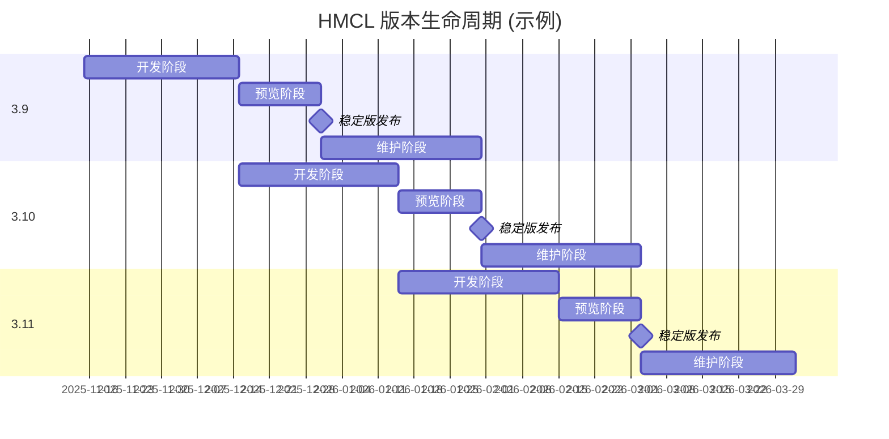

# Hello Minecraft! Launcher 发布计划

<!-- #BEGIN LANGUAGE_SWITCHER -->
[English](ReleaseSchedule.md) | **中文** (**简体**, [繁體](ReleaseSchedule_zh_Hant.md))
<!-- #END LANGUAGE_SWITCHER -->

本文介绍了自 2025 年 10 月起的 HMCL 版本发布计划。

## 版本规则

### 版本分支

HMCL 存在多个**版本分支**，每个版本分支都以 `<主版本号>.<次版本号>` 的形式命名 (例如 `3.7`)。

其中，主版本号仅在 HMCL 发生重大架构变化时递增，次版本号会根据发布计划定时递增。

### 版本类型

HMCL 具有两种版本类型: **稳定版**和**开发版**。

#### 稳定版

HMCL 稳定版适合优先追求软件稳定性的用户使用。新功能在经过充分测试后才会被合并到稳定版中。

HMCL 稳定版版本号遵循 `<版本分支>.<构建号>` 的命名规则 (例如 `3.7.1`)。其中构建号对每个版本分支独立计算。

#### 开发版

HMCL 开发版适合希望优先体验新功能的用户使用。开发版会包含最新功能和 BUG 修复，但因为未经过充分测试，也可能会存在更多问题。

HMCL 开发版遵循 `<版本分支>.0.<构建号>` 的命名规则 (例如 `3.7.0.300`)。其中构建号对所有版本分支全局共享。

## 发布通道

HMCL 具有两个主要发布通道：**稳定版通道**和**开发版通道**。
它们分别用于发布 HMCL 稳定版和开发版。

为了在正式发布前测试 HMCL 版本，我们会向部分用户优先推送更新。
用户可以在「设置 > 通用」页面中打开「提前预览 HMCL 版本」选项以接收到对应通道的预览更新。

## 发布模型

通常情况下，我们每个月发布一个版本分支，每个版本分支 `x.y` 生命周期为两个半月。

每个版本分支生命周期分为以下阶段:

1. **开发阶段** (M 月中旬 ~ M+1 月中旬)

   在此阶段，该版本在 Git 分支 `main` 中进行开发。

   通常情况下，我们每周都会基于该分支发布一个开发版 `x.y.0.<构建号>`，其中包含当周合并的所有功能和错误修复。

2. **预览阶段** (M+1 月中旬 ~ M+1 月底)

   在 M+1 月中旬，我们会基于 Git 分支 `main` 分叉出分支 `release/x.y`，其对应的版本分支固定为 `x.y`。

   与此同时，Git 分支 `main` 对应的版本分支递增至 `x.y♯`，进入下一个版本分支的开发版阶段。

   在完成分叉后，该版本分支不会新增更多功能，只会进行错误修复和数据更新。

   我们会在数日内发布稳定版预览 `x.y.1`，并将其推送给稳定版通道且接受预览更新的用户。

   在 M+1 月底前，版本分支 `x.y` 对应的稳定版将一直保持预览状态。
   若在预览过程中发现问题，我们会在修复后发布并推送新稳定版预览 (如 `x.y.2`、`x.y.3` 等)。

3. **稳定版发布** (M+1 月底)

   在 M+1 月底，如果没有意外情况，我们会将最新的稳定版预览 `x.y.z` 提升为正式版本，推送给稳定版通道的全部用户。

4. **维护阶段** (M+2 月)

   在 M+2 月，版本分支 `x.y` 进入维护阶段。我们会根据修复的问题数量和严重程度不定期地发布稳定版更新，并推送给稳定版通道的全部用户。

   在 M+2 月底，版本分支 `x.y♯` 对应的稳定版正式发布后，版本分支 `x.y` 生命周期结束，Git 分支 `release/x.y` 被存档，不再接受更新。

## 长期支持版本分支

部分特殊版本分支会被我们选择为长期支持 (LTS) 版本分支，
其生命周期不会因为下一个版本分支对应的稳定版正式发布而结束。
我们会在更长的时间中继续为这些分支移植必要的补丁。

长期支持版本分支列表：

| 版本分支 |      正式发布日期      | 生命周期结束日期 | 当前受支持状态 | 备注                                                       |
|------|:----------------:|:--------:|:-------:|:---------------------------------------------------------|
| 3.6  | 2024 年 11 月 23 日 |    未定    |   支持中   | 这是最后一个支持使用 Java 8 运行的版本分支， 该版本分支适用于 Windows XP 等旧平台用户 |
