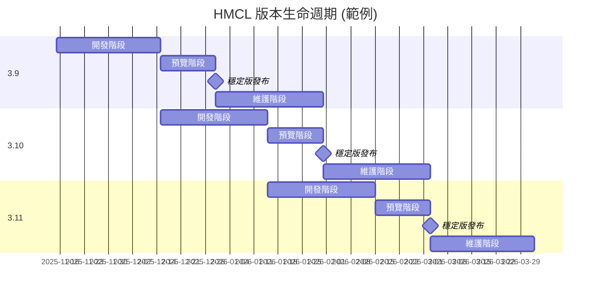

# Hello Minecraft! Launcher 發布計劃

<!-- #BEGIN LANGUAGE_SWITCHER -->
[English](ReleaseSchedule.md) | **中文** ([简体](ReleaseSchedule_zh.md), **繁體**)
<!-- #END LANGUAGE_SWITCHER -->

本文介紹了自 2025 年 10 月起的 HMCL 版本發布計劃。

## 版本規則

### 版本分支

HMCL 存在多個**版本分支**，每個版本分支都以 `<主版本號>.<次版本號>` 的形式命名 (例如 `3.7`)。

其中，主版本號僅在 HMCL 發生重大架構變化時遞增，次版本號會根據發布計劃定時遞增。

### 版本類型

HMCL 具有兩種版本類型: **穩定版**和**開發版**。

#### 穩定版

HMCL 穩定版適合優先追求軟體穩定性的使用者使用。新功能在經過充分測試後才會被合併到穩定版中。

HMCL 穩定版版本號遵循 `<版本分支>.<構建號>` 的命名規則 (例如 `3.7.1`)。其中構建號對每個版本分支獨立計算。

#### 開發版

HMCL 開發版適合希望優先體驗新功能的使用者使用。開發版會包含最新功能和 Bug 修復，但因為未經過充分測試，也可能會存在更多問題。

HMCL 開發版遵循 `<版本分支>.0.<構建號>` 的命名規則 (例如 `3.7.0.300`)。其中構建號對所有版本分支全域共享。

## 發布管道

HMCL 具有兩個主要發布管道：**穩定版管道**和**開發版管道**。
它們分別用於發布 HMCL 穩定版和開發版。

為了在正式發布前測試 HMCL 版本，我們會向部分使用者優先推送更新。
使用者可以在「設定 > 一般」頁面中開啟「提前測試 HMCL 預覽版本」選項以接收到對應管道的預覽更新。

## 發布模型

通常情況下，我們每個月發布一個版本分支，每個版本分支 `x.y` 生命週期為兩個半月。

每個版本分支生命週期分為以下階段:

1. **開發階段** (M 月中旬 ~ M+1 月中旬)

   在此階段，該版本在 Git 分支 `main` 中進行開發。

   通常情況下，我們每週都會基於該分支發布一個開發版 `x.y.0.<構建號>`，其中包含當週合併的所有功能和錯誤修復。

2. **預覽階段** (M+1 月中旬 ~ M+1 月底)

   在 M+1 月中旬，我們會基於 Git 分支 `main` 分叉出分支 `release/x.y`，其對應的版本分支固定為 `x.y`。

   與此同時，Git 分支 `main` 對應的版本分支遞增至 `x.y♯`，進入下一個版本分支的開發版階段。

   在完成分叉後，該版本分支不會新增更多功能，只會進行錯誤修復和資料更新。

   我們會在數日內發布穩定版預覽 `x.y.1`，並將其推送給穩定版且接受預覽更新的使用者。

   在 M+1 月底前，版本分支 `x.y` 對應的穩定版將一直保持預覽狀態。
   若在預覽過程中發現問題，我們會在修復後發布並推送新穩定版預覽 (如 `x.y.2`、`x.y.3` 等)。

3. **穩定版發布** (M+1 月底)

   在 M+1 月底，如果沒有意外情況，我們會將最新的穩定版預覽 `x.y.z` 標記為正式版本，推送給穩定版管道的全部使用者。

4. **維護階段** (M+2 月)

   在 M+2 月，版本分支 `x.y` 進入維護階段。我們會根據修復的問題數量和嚴重程度不定期地發布穩定版更新，並推送給穩定版管道的全部使用者。

   在 M+2 月底，版本分支 `x.y♯` 對應的穩定版正式發布後，版本分支 `x.y` 生命週期結束，Git 分支 `release/x.y` 被存檔，不再接受更新。

## 長期支援版本分支

部分特殊版本分支會被我們選取為長期支援 (LTS) 版本分支，
其生命週期不會因為下一個版本分支對應的穩定版正式發布而結束。
我們會在更長的時間中繼續為這些分支移植必要的修補程式。

長期支援版本分支列表：

| 版本分支 |      正式發布日期      | 生命週期結束日期 | 目前受支援狀態 | 備註                                                       |
|------|:----------------:|:--------:|:-------:|:---------------------------------------------------------|
| 3.6  | 2024 年 11 月 23 日 |    未定    |   支援中   | 這是最後一個支援使用 Java 8 執行的版本分支， 該版本分支適用於 Windows XP 等舊平台使用者 |
